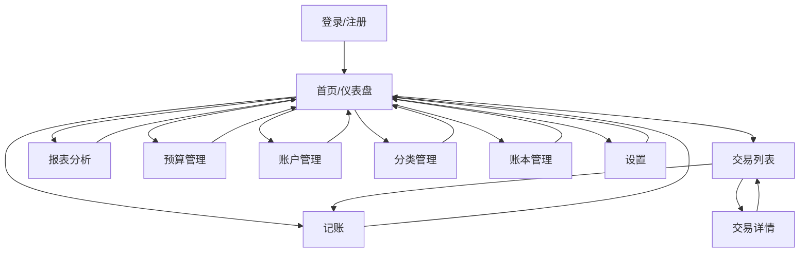

# 家庭财务管家App - UI/UX 设计规范

## 1. 设计概述

### 1.1 设计目标
- 打造简洁、直观、易用的财务管理界面
- 提供清晰的数据可视化和分析功能
- 确保响应式设计，适配不同屏幕尺寸
- 遵循现代设计原则，提供良好的用户体验

### 1.2 设计风格
- **主色调**：#4CAF50（绿色）- 代表财务健康和增长
- **辅助色**：#2196F3（蓝色）- 用于强调和交互元素
- **警告色**：#FF9800（橙色）- 用于预算提醒和警告
- **错误色**：#F44336（红色）- 用于错误提示
- **中性色**：#F5F5F5（背景）、#757575（次要文本）、#212121（主要文本）

### 1.3 设计原则
- **简洁性**：减少视觉干扰，突出核心功能
- **一致性**：统一的视觉元素和交互模式
- **可访问性**：确保所有用户都能轻松使用
- **反馈性**：提供清晰的操作反馈
- **高效性**：简化操作流程，减少用户输入

## 2. 用户流程

### 2.1 整体用户流程

### 2.2 核心用户流程

#### 2.2.1 登录/注册流程
1. 用户打开应用
2. 显示登录/注册页面
3. 用户选择登录或注册
4. 输入相应信息
5. 完成身份验证
6. 进入首页/仪表盘

#### 2.2.2 记账流程
1. 用户点击"新增交易"按钮
2. 弹出交易录入表单
3. 选择交易类型（收入/支出/转账）
4. 输入金额
5. 选择分类
6. 选择账户
7. 填写其他可选信息（商户、标签、备注）
8. 确认并保存
9. 显示保存成功提示，返回交易列表或首页

#### 2.2.3 查看报表流程
1. 用户进入"报表"页面
2. 选择时间范围（日/周/月/年）
3. 选择报表类型（支出分析、收支对比等）
4. 查看可视化图表和数据
5. 可选择导出报表

#### 2.2.4 预算管理流程
1. 用户进入"预算"页面
2. 设置月度总预算
3. 为特定分类设置预算
4. 保存预算设置
5. 查看预算执行情况和提醒

#### 2.2.5 多用户协作流程
1. 账本创建者进入账本设置
2. 邀请家庭成员
3. 分配权限级别
4. 家庭成员接受邀请
5. 开始协作记账和查看共享数据

## 3. 页面结构

### 3.1 主要页面

| 页面名称 | 模块名称 | 功能描述 |
|---------|---------|----------|
| 登录/注册页 | 登录表单 | 用户登录 |
| 登录/注册页 | 注册表单 | 新用户注册 |
| 首页/仪表盘 | 概览卡片 | 显示财务概览（总收入、总支出、净余额） |
| 首页/仪表盘 | 最近交易 | 显示最近的交易记录 |
| 首页/仪表盘 | 预算进度 | 显示预算使用情况 |
| 首页/仪表盘 | 快捷操作 | 快速访问常用功能（记账、查看报表等） |
| 交易记录页 | 交易列表 | 显示交易历史，支持排序和筛选 |
| 交易记录页 | 搜索筛选 | 按日期、分类、账户等筛选交易 |
| 交易记录页 | 新增交易 | 快速添加新交易 |
| 交易详情页 | 交易信息 | 显示交易的详细信息 |
| 交易详情页 | 编辑功能 | 编辑交易信息 |
| 交易详情页 | 删除功能 | 删除交易 |
| 记账页 | 交易表单 | 录入交易信息 |
| 报表分析页 | 时间选择 | 选择报表时间范围 |
| 报表分析页 | 报表类型 | 选择不同类型的报表 |
| 报表分析页 | 图表展示 | 数据可视化展示 |
| 报表分析页 | 导出功能 | 导出报表数据 |
| 预算管理页 | 总预算设置 | 设置月度总预算 |
| 预算管理页 | 分类预算设置 | 为分类设置预算 |
| 预算管理页 | 预算执行情况 | 显示预算使用进度和提醒 |
| 账户管理页 | 账户列表 | 显示所有账户及其余额 |
| 账户管理页 | 账户操作 | 创建、编辑、删除账户 |
| 账户管理页 | 账户转账 | 在账户间转账 |
| 分类管理页 | 分类列表 | 显示所有分类 |
| 分类管理页 | 分类操作 | 创建、编辑、删除分类 |
| 账本管理页 | 账本列表 | 显示所有账本 |
| 账本管理页 | 账本操作 | 创建、切换、编辑、删除账本 |
| 账本管理页 | 协作管理 | 邀请成员、分配权限 |
| 设置页 | 个人设置 | 个人信息管理 |
| 设置页 | 安全设置 | 密码修改、隐私设置 |
| 设置页 | 数据管理 | 数据导入导出、备份 |

### 3.2 导航结构

- **顶部导航栏**：品牌标识、当前账本选择、搜索框、用户头像
- **侧边导航**：主要功能模块导航（首页、交易、报表、预算、账户、分类、账本、设置）
- **底部导航**（移动端）：常用功能快速访问

## 4. 组件规范

### 4.1 基础组件

#### 4.1.1 按钮
- **主按钮**：填充式，主色调，用于主要操作
- **次按钮**：描边式，用于次要操作
- **文本按钮**：无背景，用于辅助操作
- **图标按钮**：仅图标，用于空间有限的场景

#### 4.1.2 输入框
- **文本输入**：用于一般文本输入
- **数字输入**：用于金额等数字输入，带格式化
- **日期选择器**：用于选择日期
- **下拉选择**：用于从选项中选择
- **多选框**：用于选择多个选项
- **开关**：用于开启/关闭功能

#### 4.1.3 卡片
- **概览卡片**：显示关键数据，带有图标和趋势
- **交易卡片**：显示交易详情，带有分类图标和金额
- **设置卡片**：包含相关设置项

#### 4.1.4 表格
- **交易表格**：显示交易列表，支持排序和筛选
- **账户表格**：显示账户列表和余额
- **分类表格**：显示分类列表

#### 4.1.5 图表
- **饼图**：用于展示支出分类占比
- **柱状图**：用于展示不同时期的收支情况
- **折线图**：用于展示财务趋势
- **仪表盘**：用于展示预算使用进度

### 4.2 组件布局

#### 4.2.1 响应式布局
- **桌面端**：多列布局，侧边导航固定
- **平板端**：双列布局，侧边导航可折叠
- **移动端**：单列布局，侧边导航转为底部导航或抽屉式菜单

#### 4.2.2 网格系统
- 使用12列网格系统，确保布局的一致性和灵活性
- 间距规范：内边距16px，组件间距8-16px

## 5. 交互设计

### 5.1 微交互
- **按钮反馈**：点击时的视觉反馈
- **表单验证**：实时验证和错误提示
- **加载状态**：数据加载时的动画
- **成功/失败提示**：操作结果的反馈
- **拖拽排序**：支持拖拽调整分类顺序

### 5.2 动画效果
- **页面切换**：平滑的页面过渡效果
- **数据更新**：数据变化时的动画效果
- **图表加载**：图表数据的动画展示
- **模态框**：弹出和关闭的动画

### 5.3 无障碍设计
- **键盘导航**：支持键盘操作
- **屏幕阅读器**：兼容屏幕阅读器
- **颜色对比度**：符合WCAG标准的颜色对比度
- **字体大小**：支持字体大小调整

## 6. 响应式设计

### 6.1 断点设置
- **桌面端**：≥1200px
- **平板端**：768px - 1199px
- **移动端**：<768px

### 6.2 适配策略
- **桌面端**：完整功能，多列布局
- **平板端**：核心功能，双列布局
- **移动端**：关键功能，单列布局，简化操作流程

### 6.3 触控优化
- **移动端**：增大点击区域（最小44px×44px）
- **手势支持**：支持滑动操作（如滑动删除交易）
- **触控反馈**：提供明确的触控反馈

## 7. 视觉设计

### 7.1 字体规范
- **主字体**：Roboto，无衬线字体
- **标题**：18-24px，粗体
- **正文**：14-16px，常规
- **辅助文本**：12px，常规

### 7.2 图标规范
- 使用Material Design图标库
- 图标风格统一，线条简洁
- 尺寸规范：16px、24px、32px

### 7.3 色彩规范
- **主色调**：#4CAF50（绿色）- 用于主要按钮、强调元素
- **辅助色**：#2196F3（蓝色）- 用于链接、次要按钮
- **警告色**：#FF9800（橙色）- 用于预算提醒、警告信息
- **错误色**：#F44336（红色）- 用于错误提示、删除操作
- **背景色**：#F5F5F5（浅灰）- 页面背景
- **卡片背景**：#FFFFFF（白色）- 卡片、表单背景
- **文本色**：#212121（深灰）- 主要文本
- **次要文本**：#757575（中灰）- 辅助文本
- **边框色**：#E0E0E0（浅灰）- 边框、分割线

### 7.4 阴影和深度
- **卡片阴影**：轻微阴影，提升层次感
- **悬浮效果**：鼠标悬停时的轻微阴影变化
- **模态框**：模糊背景，突出内容

## 8. 实现技术

### 8.1 前端技术栈
- **框架**：React + TypeScript
- **UI库**：Material-UI
- **图表库**：Chart.js
- **状态管理**：Redux
- **路由**：React Router
- **响应式设计**：CSS Flexbox + Grid

### 8.2 设计工具
- **原型设计**：Figma
- **图标**：Material Design Icons
- **色彩**：Material Design Color Palette

## 9. 设计交付物

- **UI/UX规范文档**：本文件
- **页面原型**：Figma原型链接
- **组件库**：Material-UI组件配置
- **设计系统**：色彩、字体、图标规范

## 10. 验收标准

- **视觉一致性**：所有页面视觉风格统一
- **响应式适配**：在不同设备上显示正常
- **交互流畅**：操作流畅，反馈及时
- **功能完整**：所有功能按设计实现
- **用户体验**：界面直观，操作简单

---

本UI/UX设计规范基于产品需求文档，旨在提供清晰、直观、易用的财务管理界面，帮助用户更好地管理个人和家庭财务。