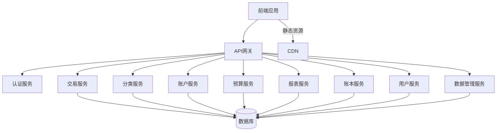

# 家庭财务管家App - 架构设计文档

## 1. 架构概览

### 1.1 系统架构

本系统采用前后端分离的模块化架构，基于现代Web技术栈实现。



### 1.2 技术栈选择

| 类别 | 技术/框架 | 版本 | 选型理由 |
|------|-----------|------|----------|
| 前端框架 | React | 18.x | 成熟稳定，生态丰富，适合构建复杂单页应用 |
| 类型系统 | TypeScript | 5.x | 提供类型安全，减少运行时错误 |
| UI库 | Material-UI | 5.x | 符合设计规范，组件丰富，支持响应式设计 |
| 状态管理 | Redux Toolkit | 1.9.x | 统一状态管理，简化数据流 |
| 路由 | React Router | 6.x | 成熟的前端路由解决方案 |
| 图表库 | Chart.js | 4.x | 轻量级，功能丰富，适合财务数据可视化 |
| 后端框架 | Node.js + Express | 18.x | 高性能，生态成熟，适合构建RESTful API |
| 数据库 | PostgreSQL | 14.x | 强大的关系型数据库，支持复杂查询和事务 |
| 认证 | JWT | - | 无状态认证，便于水平扩展 |
| 部署 | Docker | - | 容器化部署，环境一致性 |
| 缓存 | Redis | 7.x | 提高数据访问速度，减轻数据库压力 |

## 2. 前端架构

### 2.1 模块划分

```
/src
  /components        # 通用组件
    /common          # 基础UI组件
    /layout          # 布局组件
    /transaction     # 交易相关组件
    /category        # 分类相关组件
    /account         # 账户相关组件
    /budget          # 预算相关组件
    /report          # 报表相关组件
    /ledger          # 账本相关组件
    /user            # 用户相关组件
    /data            # 数据管理相关组件
  /pages            # 页面组件
    /auth            # 登录注册页面
    /dashboard       # 仪表盘页面
    /transaction     # 交易相关页面
    /category        # 分类管理页面
    /account         # 账户管理页面
    /budget          # 预算管理页面
    /report          # 报表分析页面
    /ledger          # 账本管理页面
    /settings        # 设置页面
  /services          # API服务
  /hooks             # 自定义Hooks
  /store             # Redux状态管理
  /utils             # 工具函数
  /types             # TypeScript类型定义
  /constants         # 常量定义
  /styles            # 全局样式
  App.tsx            # 应用入口
  index.tsx          # 渲染入口
  routes.tsx         # 路由配置
```

### 2.2 核心数据流

采用Redux Toolkit管理全局状态，数据流如下：

1. 组件通过dispatch触发action
2. Action被reducer处理，更新state
3. 组件通过useSelector订阅state变化
4. 异步操作通过createAsyncThunk处理

### 2.3 响应式设计

- 桌面端（≥1200px）：多列布局，侧边导航固定
- 平板端（768px-1199px）：双列布局，侧边导航可折叠
- 移动端（<768px）：单列布局，侧边导航转为底部导航或抽屉式菜单

## 3. 后端架构

### 3.1 模块划分

```
/src
  /controllers       # 控制器
  /services          # 业务逻辑
  /models            # 数据模型
  /routes            # 路由
  /middleware        # 中间件
  /utils             # 工具函数
  /config            # 配置
  /validators        # 数据验证
  /auth              # 认证相关
  app.js             # 应用入口
  server.js          # 服务器启动
```

### 3.2 API设计

采用RESTful API设计风格，主要API端点：

| 模块 | 端点 | 方法 | 功能 |
|------|------|------|------|
| 认证 | /api/auth/register | POST | 用户注册 |
| 认证 | /api/auth/login | POST | 用户登录 |
| 认证 | /api/auth/refresh | POST | 刷新token |
| 交易 | /api/transactions | GET | 获取交易列表 |
| 交易 | /api/transactions | POST | 创建交易 |
| 交易 | /api/transactions/:id | PUT | 更新交易 |
| 交易 | /api/transactions/:id | DELETE | 删除交易 |
| 分类 | /api/categories | GET | 获取分类列表 |
| 分类 | /api/categories | POST | 创建分类 |
| 分类 | /api/categories/:id | PUT | 更新分类 |
| 分类 | /api/categories/:id | DELETE | 删除分类 |
| 账户 | /api/accounts | GET | 获取账户列表 |
| 账户 | /api/accounts | POST | 创建账户 |
| 账户 | /api/accounts/:id | PUT | 更新账户 |
| 账户 | /api/accounts/:id | DELETE | 删除账户 |
| 预算 | /api/budgets | GET | 获取预算列表 |
| 预算 | /api/budgets | POST | 创建预算 |
| 预算 | /api/budgets/:id | PUT | 更新预算 |
| 预算 | /api/budgets/:id | DELETE | 删除预算 |
| 报表 | /api/reports/expense | GET | 获取支出报表 |
| 报表 | /api/reports/income | GET | 获取收入报表 |
| 报表 | /api/reports/balance | GET | 获取收支对比报表 |
| 账本 | /api/ledgers | GET | 获取账本列表 |
| 账本 | /api/ledgers | POST | 创建账本 |
| 账本 | /api/ledgers/:id | PUT | 更新账本 |
| 账本 | /api/ledgers/:id | DELETE | 删除账本 |
| 账本 | /api/ledgers/:id/members | POST | 邀请成员 |
| 数据 | /api/data/export | GET | 导出数据 |
| 数据 | /api/data/import | POST | 导入数据 |

### 3.3 数据库设计

#### 核心表结构

**users表**
| 字段名 | 数据类型 | 约束 | 描述 |
|--------|----------|------|------|
| id | SERIAL | PRIMARY KEY | 用户ID |
| email | VARCHAR(255) | UNIQUE NOT NULL | 邮箱 |
| password_hash | VARCHAR(255) | NOT NULL | 密码哈希 |
| name | VARCHAR(100) | NOT NULL | 用户名 |
| created_at | TIMESTAMP | DEFAULT CURRENT_TIMESTAMP | 创建时间 |
| updated_at | TIMESTAMP | DEFAULT CURRENT_TIMESTAMP | 更新时间 |

**ledgers表**
| 字段名 | 数据类型 | 约束 | 描述 |
|--------|----------|------|------|
| id | SERIAL | PRIMARY KEY | 账本ID |
| name | VARCHAR(100) | NOT NULL | 账本名称 |
| description | TEXT | | 描述 |
| created_by | INTEGER | REFERENCES users(id) | 创建者ID |
| created_at | TIMESTAMP | DEFAULT CURRENT_TIMESTAMP | 创建时间 |
| updated_at | TIMESTAMP | DEFAULT CURRENT_TIMESTAMP | 更新时间 |

**ledger_members表**
| 字段名 | 数据类型 | 约束 | 描述 |
|--------|----------|------|------|
| id | SERIAL | PRIMARY KEY | 成员ID |
| ledger_id | INTEGER | REFERENCES ledgers(id) | 账本ID |
| user_id | INTEGER | REFERENCES users(id) | 用户ID |
| role | VARCHAR(50) | NOT NULL | 角色（owner/member） |
| created_at | TIMESTAMP | DEFAULT CURRENT_TIMESTAMP | 创建时间 |

**accounts表**
| 字段名 | 数据类型 | 约束 | 描述 |
|--------|----------|------|------|
| id | SERIAL | PRIMARY KEY | 账户ID |
| name | VARCHAR(100) | NOT NULL | 账户名称 |
| type | VARCHAR(50) | NOT NULL | 账户类型 |
| balance | DECIMAL(12,2) | DEFAULT 0 | 余额 |
| ledger_id | INTEGER | REFERENCES ledgers(id) | 账本ID |
| created_at | TIMESTAMP | DEFAULT CURRENT_TIMESTAMP | 创建时间 |
| updated_at | TIMESTAMP | DEFAULT CURRENT_TIMESTAMP | 更新时间 |

**categories表**
| 字段名 | 数据类型 | 约束 | 描述 |
|--------|----------|------|------|
| id | SERIAL | PRIMARY KEY | 分类ID |
| name | VARCHAR(100) | NOT NULL | 分类名称 |
| type | VARCHAR(50) | NOT NULL | 类型（income/expense） |
| parent_id | INTEGER | REFERENCES categories(id) | 父分类ID |
| ledger_id | INTEGER | REFERENCES ledgers(id) | 账本ID |
| created_at | TIMESTAMP | DEFAULT CURRENT_TIMESTAMP | 创建时间 |
| updated_at | TIMESTAMP | DEFAULT CURRENT_TIMESTAMP | 更新时间 |

**transactions表**
| 字段名 | 数据类型 | 约束 | 描述 |
|--------|----------|------|------|
| id | SERIAL | PRIMARY KEY | 交易ID |
| amount | DECIMAL(12,2) | NOT NULL | 金额 |
| type | VARCHAR(50) | NOT NULL | 类型（income/expense/transfer） |
| category_id | INTEGER | REFERENCES categories(id) | 分类ID |
| account_id | INTEGER | REFERENCES accounts(id) | 账户ID |
| from_account_id | INTEGER | REFERENCES accounts(id) | 转出账户ID（转账用） |
| to_account_id | INTEGER | REFERENCES accounts(id) | 转入账户ID（转账用） |
| merchant | VARCHAR(255) | | 商户 |
| tags | TEXT[] | | 标签 |
| notes | TEXT | | 备注 |
| transaction_date | DATE | NOT NULL | 交易日期 |
| ledger_id | INTEGER | REFERENCES ledgers(id) | 账本ID |
| created_by | INTEGER | REFERENCES users(id) | 创建者ID |
| created_at | TIMESTAMP | DEFAULT CURRENT_TIMESTAMP | 创建时间 |
| updated_at | TIMESTAMP | DEFAULT CURRENT_TIMESTAMP | 更新时间 |

**budgets表**
| 字段名 | 数据类型 | 约束 | 描述 |
|--------|----------|------|------|
| id | SERIAL | PRIMARY KEY | 预算ID |
| amount | DECIMAL(12,2) | NOT NULL | 预算金额 |
| start_date | DATE | NOT NULL | 开始日期 |
| end_date | DATE | NOT NULL | 结束日期 |
| category_id | INTEGER | REFERENCES categories(id) | 分类ID |
| ledger_id | INTEGER | REFERENCES ledgers(id) | 账本ID |
| created_at | TIMESTAMP | DEFAULT CURRENT_TIMESTAMP | 创建时间 |
| updated_at | TIMESTAMP | DEFAULT CURRENT_TIMESTAMP | 更新时间 |

## 4. 核心功能实现

### 4.1 交易管理

- 实现交易的CRUD操作
- 支持收入、支出、转账三种交易类型
- 提供交易搜索和筛选功能
- 实现交易数据的实时更新

### 4.2 分类管理

- 实现分类的CRUD操作
- 支持分类的层级结构
- 提供默认分类和自定义分类

### 4.3 账户管理

- 实现账户的CRUD操作
- 支持不同类型的账户
- 实现账户间转账功能
- 实时更新账户余额

### 4.4 预算管理

- 实现预算的设置和管理
- 支持月度总预算和分类预算
- 提供预算使用情况的实时监控
- 实现预算提醒功能

### 4.5 报表与分析

- 实现支出分析报表
- 实现收支对比报表
- 支持按日、周、月、年查看数据
- 提供数据可视化图表

### 4.6 账本管理

- 实现账本的CRUD操作
- 支持多账本功能
- 实现账本成员管理和权限控制

### 4.7 数据管理

- 实现数据导出功能（CSV、Excel）
- 实现数据导入功能
- 实现数据备份和恢复功能

### 4.8 用户系统

- 实现用户注册和登录功能
- 支持JWT认证
- 实现密码重置功能
- 提供用户设置管理

### 4.9 多用户协作

- 实现账本成员邀请功能
- 实现权限管理
- 支持协作记账和数据共享

## 5. 安全设计

### 5.1 认证与授权

- 使用JWT进行身份认证
- 实现基于角色的访问控制（RBAC）
- 密码使用bcrypt加密存储
- 敏感操作需要二次验证

### 5.2 数据安全

- 数据传输使用HTTPS
- 敏感数据加密存储
- 定期数据备份
- 防止SQL注入和XSS攻击

### 5.3 安全审计

- 记录关键操作日志
- 定期安全检查和漏洞扫描
- 遵循安全最佳实践

## 6. 性能优化

### 6.1 前端优化

- 代码分割和懒加载
- 组件缓存
- 图片优化
- 减少HTTP请求
- 使用CDN加速静态资源

### 6.2 后端优化

- 数据库索引优化
- 缓存常用数据
- 批量操作优化
- 异步处理耗时任务
- 数据库连接池管理

### 6.3 数据库优化

- 合理设计表结构
- 优化查询语句
- 使用索引
- 定期清理冗余数据

## 7. 部署与扩展性

### 7.1 部署架构

- 前端：静态资源部署到CDN
- 后端：容器化部署到云服务器
- 数据库：云数据库服务
- 缓存：Redis服务

### 7.2 扩展性设计

- 微服务架构，便于独立扩展
- 水平扩展支持
- 模块化设计，便于功能扩展
- API版本控制

## 8. 监控与维护

### 8.1 监控

- 应用性能监控
- 错误日志监控
- 数据库性能监控
- 系统资源监控

### 8.2 维护

- 定期备份数据
- 版本管理
- 代码审查
- 文档更新

## 9. 风险与应对

### 9.1 风险

- 用户数据安全和隐私保护
- 多平台同步的一致性
- 数据丢失的风险
- 系统性能瓶颈

### 9.2 应对措施

- 加强安全措施，加密存储敏感数据
- 实现数据同步机制，确保数据一致性
- 定期备份数据，建立灾难恢复机制
- 优化系统性能，监控系统状态

## 10. 总结

本架构设计基于现代Web技术栈，采用前后端分离的模块化架构，实现了家庭财务管家App的核心功能。设计考虑了系统的可扩展性、安全性和性能，为后续的开发和维护提供了良好的基础。

通过合理的模块划分和职责分离，系统具有良好的可维护性和可扩展性，能够满足未来功能扩展的需求。同时，采用了多种安全措施，确保用户数据的安全和隐私保护。

本架构设计为家庭财务管家App的开发提供了清晰的技术路线和实施指南。