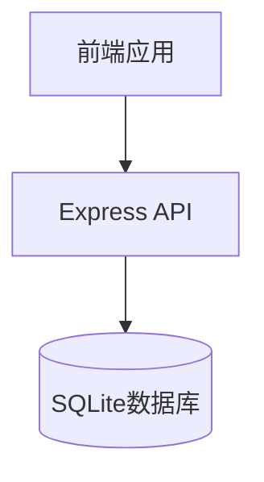

# 家庭财务管家App - 原型架构设计

## 1. 原型概述

本原型架构设计旨在快速验证家庭财务管家App的核心功能可行性，采用简化的技术栈和架构，便于在本地环境快速搭建和测试。

### 1.1 原型目标

- 验证核心功能的可行性和用户流程
- 提供基础的记账、分类、账户管理功能
- 确保数据持久化和基本的用户体验
- 为后续完整开发提供参考和验证

### 1.2 技术栈选择

| 类别 | 技术/框架 | 版本 | 选型理由 |
|------|-----------|------|----------|
| 前端框架 | React | 18.x | 成熟稳定，适合快速开发 |
| 类型系统 | TypeScript | 5.x | 提供类型安全，减少错误 |
| UI库 | Material-UI | 5.x | 组件丰富，开发效率高 |
| 状态管理 | React Context API | - | 轻量级，适合小型应用 |
| 路由 | React Router | 6.x | 基础路由功能 |
| 后端框架 | Express | 4.x | 轻量级，易于搭建 |
| 数据库 | SQLite | 3.x | 本地文件数据库，无需额外服务 |
| API通信 | Fetch API | - | 浏览器内置，无需额外依赖 |

## 2. 架构设计

### 2.1 系统架构



### 2.2 目录结构

```
proto-app/
  /frontend            # 前端应用
    /src
      /components      # 组件
        /transaction   # 交易相关组件
        /category      # 分类相关组件
        /account       # 账户相关组件
        /report        # 报表相关组件
      /contexts        # 状态管理
        AppContext.tsx # 全局状态管理
      /pages           # 页面
        Dashboard.tsx  # 仪表盘
        Transaction.tsx # 交易管理
        Category.tsx   # 分类管理
        Account.tsx    # 账户管理
        Report.tsx     # 报表分析
      /utils           # 工具函数
      App.tsx          # 应用入口
      index.tsx        # 渲染入口
      routes.tsx       # 路由配置
    package.json       # 前端依赖
  /backend             # 后端服务
    server.js          # API服务
    database.js        # 数据库配置
    package.json       # 后端依赖
```

### 2.3 数据模型

#### 核心表结构

**users表**
| 字段名 | 数据类型 | 约束 | 描述 |
|--------|----------|------|------|
| id | INTEGER | PRIMARY KEY AUTOINCREMENT | 用户ID |
| name | TEXT | NOT NULL | 用户名 |
| email | TEXT | UNIQUE NOT NULL | 邮箱 |

**accounts表**
| 字段名 | 数据类型 | 约束 | 描述 |
|--------|----------|------|------|
| id | INTEGER | PRIMARY KEY AUTOINCREMENT | 账户ID |
| name | TEXT | NOT NULL | 账户名称 |
| balance | REAL | DEFAULT 0 | 余额 |

**categories表**
| 字段名 | 数据类型 | 约束 | 描述 |
|--------|----------|------|------|
| id | INTEGER | PRIMARY KEY AUTOINCREMENT | 分类ID |
| name | TEXT | NOT NULL | 分类名称 |
| type | TEXT | NOT NULL | 类型（income/expense） |

**transactions表**
| 字段名 | 数据类型 | 约束 | 描述 |
|--------|----------|------|------|
| id | INTEGER | PRIMARY KEY AUTOINCREMENT | 交易ID |
| amount | REAL | NOT NULL | 金额 |
| type | TEXT | NOT NULL | 类型（income/expense） |
| category_id | INTEGER | REFERENCES categories(id) | 分类ID |
| account_id | INTEGER | REFERENCES accounts(id) | 账户ID |
| date | TEXT | NOT NULL | 交易日期 |
| merchant | TEXT | | 商户 |
| notes | TEXT | | 备注 |

## 3. 核心功能实现

### 3.1 前端实现

#### 3.1.1 状态管理

使用React Context API实现全局状态管理，包含：
- 交易数据
- 分类数据
- 账户数据
- 基本的CRUD操作方法

#### 3.1.2 页面结构

- **仪表盘**：显示财务概览、最近交易
- **交易管理**：添加、查看、编辑、删除交易
- **分类管理**：管理收入和支出分类
- **账户管理**：管理账户和余额
- **报表分析**：简单的收支分析

#### 3.1.3 组件设计

- **交易表单**：用于添加和编辑交易
- **交易列表**：显示交易历史
- **分类选择器**：选择交易分类
- **账户选择器**：选择交易账户
- **简单图表**：展示收支数据

### 3.2 后端实现

#### 3.2.1 API设计

| 端点 | 方法 | 功能 |
|------|------|------|
| /api/transactions | GET | 获取交易列表 |
| /api/transactions | POST | 创建交易 |
| /api/transactions/:id | PUT | 更新交易 |
| /api/transactions/:id | DELETE | 删除交易 |
| /api/categories | GET | 获取分类列表 |
| /api/categories | POST | 创建分类 |
| /api/accounts | GET | 获取账户列表 |
| /api/accounts | POST | 创建账户 |

#### 3.2.2 数据库操作

- 使用SQLite3进行数据库操作
- 实现基本的CRUD操作
- 自动创建表结构和默认数据

## 4. 实施步骤

### 4.1 环境搭建

1. **创建项目目录**
   ```bash
   mkdir -p proto-app/frontend proto-app/backend
   ```

2. **初始化前端项目**
   ```bash
   cd proto-app/frontend
   npm create vite@latest . -- --template react-ts
   npm install @mui/material @emotion/react @emotion/styled react-router-dom
   ```

3. **初始化后端项目**
   ```bash
   cd ../backend
   npm init -y
   npm install express sqlite3 cors
   ```

### 4.2 数据库配置

- 创建SQLite数据库文件
- 设计并创建表结构
- 插入默认分类数据

### 4.3 后端API实现

- 实现交易相关API
- 实现分类相关API
- 实现账户相关API

### 4.4 前端状态管理

- 创建全局状态管理Context
- 实现数据获取和CRUD操作方法

### 4.5 前端页面实现

- 实现仪表盘页面
- 实现交易管理页面
- 实现分类管理页面
- 实现账户管理页面
- 实现报表分析页面

### 4.6 路由配置

- 设置前端路由
- 配置导航菜单

## 5. 运行和测试

### 5.1 启动服务

1. **启动后端服务**
   ```bash
   cd proto-app/backend
   node server.js
   ```

2. **启动前端服务**
   ```bash
   cd ../frontend
   npm run dev
   ```

### 5.2 测试流程

1. **添加账户**：在账户管理页面添加几个账户
2. **添加交易**：在记账页面添加几笔收入和支出
3. **查看仪表盘**：确认交易数据正确显示
4. **测试分类**：添加自定义分类并使用
5. **验证数据持久化**：重启服务后确认数据仍然存在

### 5.3 验证要点

- **功能验证**：核心记账功能是否正常
- **数据持久化**：SQLite是否正确保存数据
- **用户体验**：界面是否直观易用
- **性能**：操作是否流畅

## 6. 后续扩展

### 6.1 功能扩展

- 添加预算管理功能
- 实现多账本支持
- 增加数据导入导出
- 添加用户认证

### 6.2 技术升级

- 迁移到PostgreSQL数据库
- 集成Redux进行状态管理
- 添加单元测试和集成测试
- 优化前端性能

### 6.3 部署方案

- 容器化部署（Docker）
- 前端静态资源部署到CDN
- 后端服务部署到云服务器

## 7. 总结

本原型架构设计提供了一个快速验证家庭财务管家App可行性的方案，采用简化的技术栈和架构，便于在本地环境快速搭建和测试。通过实现核心的记账、分类、账户管理功能，验证了系统的基本流程和数据处理能力。

该原型为后续的完整开发提供了基础，开发和测试人员可以基于此架构进行功能扩展和技术升级，最终实现一个功能完整、用户友好的家庭财务管家应用。